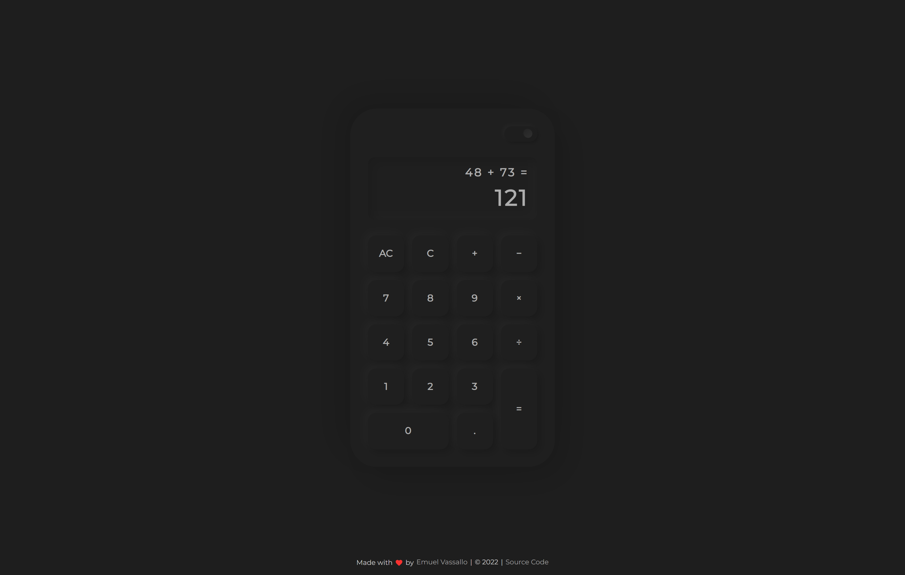
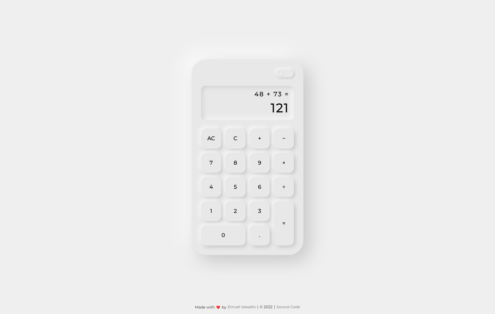

# Calculator

A neumorphic web calculator with keyboard support. Created as part of The Odin Project's [curriculum](https://www.theodinproject.com/lessons/foundations-calculator).

### [Live Demo](https://emuel-vassallo.github.io/calculator/)

## Showcase

### Dark Theme

### Light Theme

## Built With

- HTML
- CSS
- JavaScript

## Features

- Neumorphism Design
- Keyboard support
- Dark/Light theme toggle button
- Smooth animations and transitions

## What I learned

- Clicking buttons when corresponding keyboard key is down
- Creating a decent looking UI with Neumorphism
- Using an imported font
- Using array functions
- Using arrays to store multiple values
- Using objects and accessing values from them
- Using string functions like split to get an array

## TODO

- [x] Light/Dark theme toggle button

## Credits and Inspiration

- [neumorphism.io](https://neumorphism.io/#e8e8e8)
- [Neomorphism button design](https://uiverse.io/detail/adamgiebl/lucky-donkey-6) by [adamgiebl](https://github.com/adamgiebl)
- [Neumorphic calculator](https://dribbble.com/shots/12109039-Calculator) by [Sim Mico](https://dribbble.com/S_U_P)
- [Neumorphic calculator](https://dribbble.com/shots/10490828-Neomorphic-Caluculator) by [Siddharth Simharaju](https://dribbble.com/SiddharthSimharaju)
- [Calculator project submission](https://github.com/michalosman/calculator) from [michalosman](https://github.com/michalosman)
